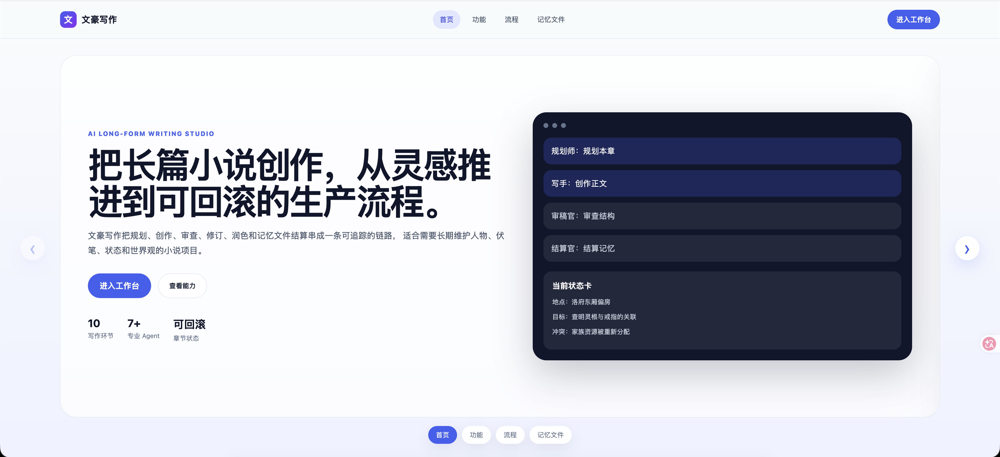
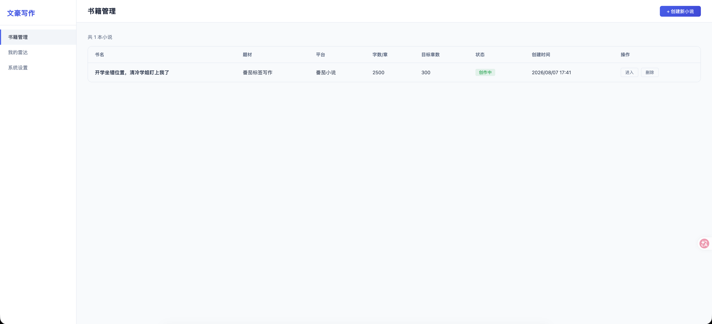
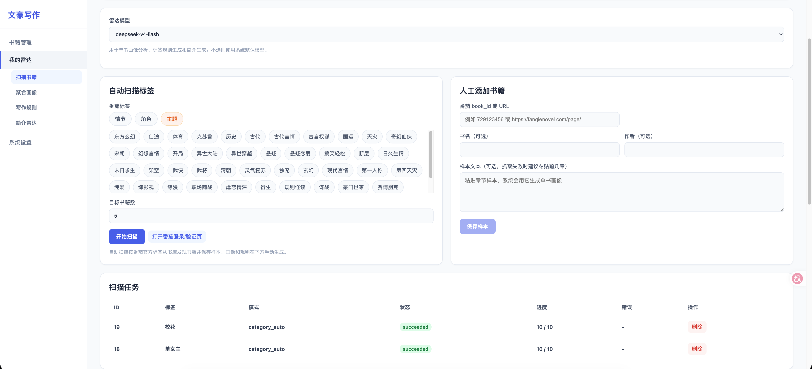
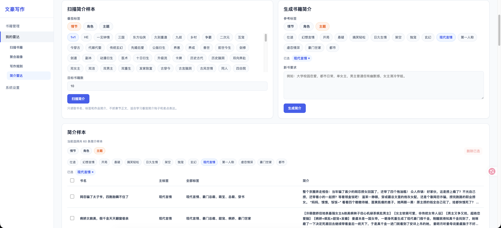
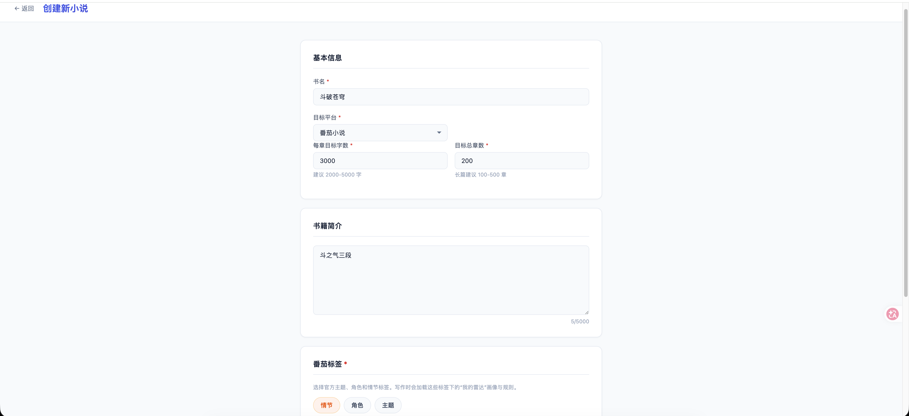
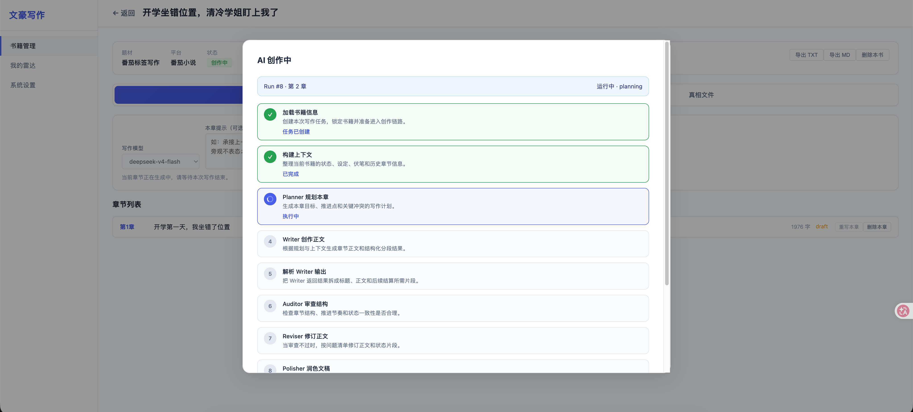
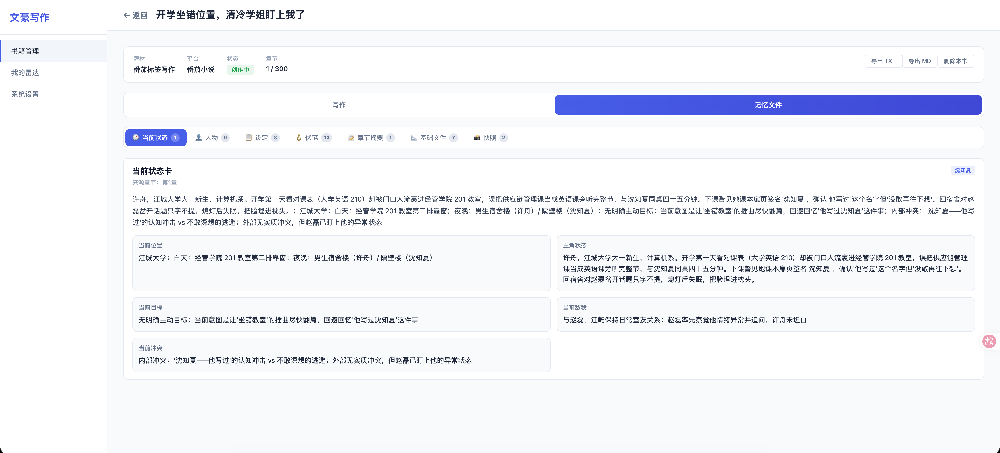

# 文豪写作

面向中文长篇网文的本地 AI 写作工作台。它将“生成下一章”拆成可追踪的写作流水线，并维护世界观、角色、事实、伏笔、章节摘要与当前状态，降低长篇创作中的设定漂移和上下文遗忘。

项目内置“我的雷达”：从番茄小说指定标签采集样本，生成单书画像、标签聚合画像和写作规则；创建新书时选择对应标签，相关规则会随章节写作上下文注入。

> 本项目需要自行配置兼容 OpenAI Chat Completions 的模型服务。模型密钥只通过本地工作台保存，不写入仓库配置。



## 核心能力

- **受控章节写作**：每次写作依次完成上下文构建、章节规划、正文创作、连续性审稿、修订评分、润色、记忆提取和快照保存。
- **长期记忆管理**：保存基础设定、当前状态卡、角色档案、长期事实、伏笔、章节摘要和章节快照，并在下一章按优先级组装上下文。
- **可恢复的写作任务**：每个写作环节均记录输入、输出和状态；支持取消、失败后从失败阶段续跑，以及服务重启后的中断任务归档。
- **番茄写法雷达**：按官方标签扫描或人工导入书籍；固定采集前 10 章有效正文，分析为单书画像，再聚合为标签画像与可执行规则。
- **简介学习与生成**：采集同标签作品简介，基于多个标签样本生成新书标题、简介和卖点。
- **可观察性与导出**：工作台展示每次写作的阶段进度和 Token 消耗，书籍可导出为 TXT 或 Markdown。

## 界面预览

### 宣传页

展示产品定位、核心能力、写作流水线与记忆文件体系。



### 我的雷达：采样与章节核验

按主题、角色、情节标签扫描样本书籍，也可粘贴番茄 `book_id` 或 URL 手动添加。章节正文会经过有效性校验，过滤字数、更新时间、验证码等页面元信息。



### 我的雷达：画像、规则与简介

对同标签书籍生成单书画像，再合成为聚合画像和写作规则；简介样本独立管理，可用于生成新书简介。



### 创建新书

填写书名、目标平台、章节长度、总章数和故事简介，选择番茄标签及模型。标签对应的雷达规则会自动关联到这本书。



### 写作流水线

以任务形式执行章节创作并显示实时进度。审稿发现问题时会生成修订候选稿，并由评分器决定是否替换原稿。



### 记忆文件

章节完成后自动提炼并更新小说运行状态。工作台可查看当前状态、角色、长期设定、伏笔、章节摘要、基础文件和历史快照。



## 工作流

```text
配置模型
  -> 初始化基础数据
  -> 可选：在“我的雷达”采样并生成标签规则
  -> 创建新书并选择标签
  -> 初始化书籍基础设定
  -> 运行章节写作任务
  -> 审稿 / 修订 / 润色
  -> 更新记忆文件与章节快照
  -> 导出 TXT 或 Markdown
```

章节运行时的核心链路如下：

```text
基础设定 + 当前状态 + 角色/事实/伏笔 + 最近章节摘要 + 雷达规则 + 用户提示
  -> Planner：生成本章备忘录
  -> Composer：构建上下文包与规则栈
  -> Writer：生成正文
  -> Auditor：检查连续性和质量问题
  -> Reviser + Scorer：修订并判断是否采纳
  -> Polisher：文字润色
  -> Settler / Truth Extractor：更新状态、角色、事实、伏笔和摘要
  -> Snapshot：保存可回溯快照
```

## 快速开始

### 环境要求

- Go `1.26.3`（以 `backend/go.mod` 为准）
- Node.js `20+`
- npm
- macOS 上使用雷达章节抓取时：Google Chrome

### 1. 启动后端

```bash
cd backend
go run ./cmd/whwriter
```

后端默认监听 `http://localhost:8080`，SQLite 数据库默认创建于 `backend/data/whwriter.db`。

### 2. 启动前端

另开一个终端：

```bash
cd frontend
npm install
npm run dev
```

访问 Vite 输出的本地地址，通常为 `http://localhost:5173`。开发服务器已将 `/api` 和 `/health` 代理至后端 `8080` 端口。

### 3. 完成首次配置

1. 打开“系统设置”，点击“初始化基础数据”，写入平台、兼容题材和番茄标签。
2. 在“模型厂商”中新增 OpenAI 兼容服务的 `Base URL` 与 API Key。
3. 测试连接并导入模型，至少启用一个模型并设为默认模型。
4. 创建新书。系统会初始化世界观、大纲、规则等基础记忆文件；创建完成后即可写作。

## 雷达数据采集

雷达只采样每本书的前 10 章，且正文必须超过 200 字，并排除常见页面元信息。采集优先级为：

```text
配置的第三方正文接口
  -> 带番茄登录态 Cookie 的 HTTP 请求
  -> 本机 Chrome CDP 后台页面抓取
```

本地开发默认会启动独立 Chrome 用户目录 `$HOME/.whwriter-chrome`，调试端口为 `9222`。在“我的雷达”点击“打开番茄登录/验证页”后完成登录或验证；后续后台抓取不会抢占当前浏览器标签页。

与雷达相关的配置位于 [`backend/config.yaml`](backend/config.yaml)：

```yaml
browser:
  auto_launch: true
  chrome_app_name: "Google Chrome"
  user_data_dir: "$HOME/.whwriter-chrome"
  cdp_url: "http://127.0.0.1:9222"

radar:
  # 支持 {item_id}，可通过 WHWRITER_FANQIE_CONTENT_API_URL 环境变量覆盖
  fanqie_content_api_url: "http://your-service/api/raw_full?item_id={item_id}"
```

第三方正文接口不可用时，系统会自动降级到本地登录态和 CDP 抓取。请仅对你有权访问的数据进行采集，并遵守目标站点的服务条款。

## 项目结构

```text
.
├── backend/
│   ├── cmd/whwriter/            # 服务入口
│   └── internal/
│       ├── agent/               # Architect、Planner、Writer、Auditor 等 Agent
│       ├── pipeline/            # 书籍初始化与章节写作编排
│       ├── service/             # 雷达采集、浏览器 CDP 与业务服务
│       ├── repository/sqlite/   # SQLite 持久化与迁移
│       └── handler/             # Gin HTTP API
├── frontend/
│   └── src/views/               # 工作台、创建书籍、雷达等 Vue 页面
├── deploy/                      # systemd + Nginx + SQLite 部署脚本
└── docs/images/                 # README 截图存放位置
```

## 常用命令

```bash
# 后端测试
cd backend && go test ./...

# 前端生产构建
cd frontend && npm run build

# 生产环境部署
cd /opt/whwriter && bash deploy/install.sh
```

服务器部署、备份与恢复请参阅 [`deploy/README.md`](deploy/README.md)。

## 技术栈

- 后端：Go、Gin、GORM、SQLite、CloudWeGo Eino
- 前端：Vue 3、Vite、Vue Router
- 模型接口：OpenAI 兼容 Chat Completions
- 浏览器自动化：Chrome DevTools Protocol（CDP）
